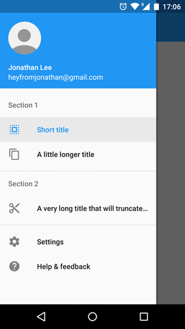
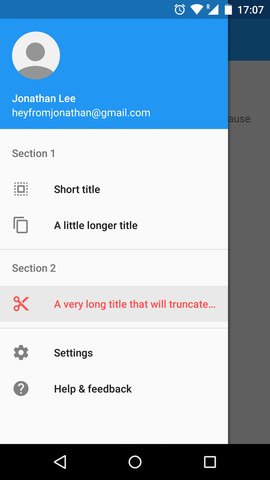
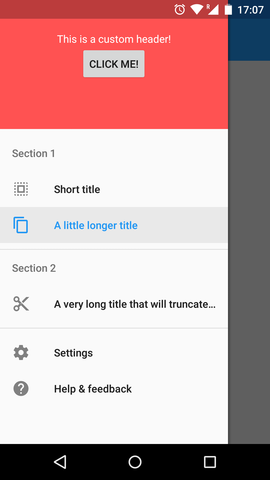

# Material Design Navigation Drawer for Android

Simple navigation drawer library for Android applications.

## Screenshots

[](art/demo.png)
[]((art/demo-custom-color.png))
[](art/demo-custom-header.png)


## Features

* Follows the [material design guidelines](http://www.google.com/design/spec/patterns/navigation-drawer.html)
* Pre-defined navigation drawer entries
  * Simple icon & text entry
  * Subheaders
  * Divider
  * Settings entry
  * Support entry ("Help & feedback")
* Default navigation drawer header with title, subtitle, icon, and background image
* Custom navigation drawer header support

## Sample

A small sample application can be found [here](sample).

The sample app is also on Google Play:

[](https://play.google.com/store/apps/details?id=com.oprisnik.navdrawer.sample)


## Usage

This library is available on jCenter.
Just add the following dependency to your `build.gradle`:

```groovy
dependencies {
  compile 'com.oprisnik:navdrawer:1.0.4'
}
```

### Activity

Declare `com.oprisnik.navdrawer.widget.NavDrawerLayout` as the root element of your layout file.
Add your content as a child of the `NavDrawerLayout`.
Don't forget to give your navigation drawer layout an ID so that the view state can be saved / restored properly.

Example `activity.xml`:

```xml
<com.oprisnik.navdrawer.widget.NavDrawerLayout
    xmlns:android="http://schemas.android.com/apk/res/android"
    android:id="@+id/navigation_drawer"
    android:layout_width="match_parent"
    android:layout_height="match_parent"
    android:fitsSystemWindows="true">

    <TextView
        android:layout_width="match_parent"
        android:padding="@dimen/padding"
        android:layout_height="wrap_content"
        android:text="Here comes your content!"/>
</com.oprisnik.navdrawer.widget.NavDrawerLayout>
```

Then, let your Activity extend `com.oprisnik.navdrawer.NavDrawerActivity` and implement the required methods.

In [DemoDrawerActivity.java](sample/src/main/java/com/oprisnik/navdrawer/sample/DemoDrawerActivity.java)
you can find a simple example for a basic abstract navigation drawer activity.
[SecondActivity.java](sample/src/main/java/com/oprisnik/navdrawer/sample/SecondActivity.java) and
[MainActivity.java](sample/src/main/java/com/oprisnik/navdrawer/sample/MainActivity.java))
show how different navigation drawer sections look like.

If you do not want to extend `NavDrawerActivity`, you can also take a look at [NavDrawerActivity.java](navdrawer/src/main/java/com/oprisnik/navdrawer/NavDrawerActivity.java) and add a similar logic to your Activity.


### Navigation drawer structure

The structure of the navigation drawer is a simple `List<NavDrawerEntry>` and there are several
pre-defined elements available:

* __NavDrawerEntry__ - clickable entries consisting of text and an icon
* __NavDrawerSubheader__ - section header that is not clickable
* __NavDrawerDivider__ - simple horizontal divider
* __NavDrawerDividerBeforeSubheader__ - horizontal divider to be used right above a subheader (in order to have correct spacing)
* __NavDrawerSettingsEntry__ - Default settings entry
* __NavDrawerSupportEntry__ - Default support entry ("Help & feedback")

For `NavDrawerEntries`, a builder interface is available. Example:

```java
NavDrawerEntry e = new NavDrawerEntry.Builder()
                          .setTitleResId(R.string.my_title)
                          .setIconResId(R.drawable.ic_my_icon)
                          .setSelectedColorRes(R.color.my_color)
                          .build();
```

If your navigation drawer entry performs an external call (where the entry should NOT be highlighted once clicked),
add `.setExternal(true)` to your builder.
This will prevent the navigation drawer entry from being selected.

The click action of navigation drawer entries is delayed per default until the navigation drawer animation
is finished.
If you want to be notified instantly, you can add `.setLaunchDelayed(false)` to your builder.

### Header

The navigation drawer also features a default header with a title, subtitle, icon and background (cover image).
You can access the header in your Activity as follows:

```java
getDrawerLayout().setHeaderTitle("Jonathan Lee");
getDrawerLayout().setHeaderSubtitle("heyfromjonathan@gmail.com");
getDrawerLayout().setHeaderIcon(getResources().getDrawable(R.drawable.my_image));
getDrawerLayout().setHeaderBackgroundColor(getResources().getColor(R.color.my_color));
```

You can also set a custom header by calling


```java
getDrawerLayout().setHeader(yourHeader);
```

or revert back to the default header:

```java
getDrawerLayout().setDefaultHeader();
```

If you use the default header, `onHeaderClicked()` will be called if the header is clicked by the user.

There are also XML attributes that you can use to specify your header

```xml
<com.oprisnik.navdrawer.widget.NavDrawerLayout
    xmlns:android="http://schemas.android.com/apk/res/android"
    xmlns:drawer="http://schemas.android.com/apk/res-auto"
    ...
    drawer:hasHeader="true|false"
    drawer:headerLayout="@layout/custom_header" />
```

## Toolbar

If your activity has a `Toolbar`, the `NavDrawerActivity` can set up the drawer navigation for you (hamburger icon).
In your activity, you can call the following method to enable / disable up navigation:

```java
showUpNavigation(boolean show)
```

If you enable up navigation, the up-arrow (<-) will be shown.
Otherwise the hamburger icon is displayed and automatically handled.

## Status bar color

The navigation drawer library takes care of coloring the status bar for you.

In order to get the correct behavior, you need to set the status bar color to transparent.
The status bar will then be colored according to the `colorPrimaryDark` attribute.

Example application theme:

```xml
<style name="AppTheme" parent="Theme.AppCompat.Light.NoActionBar">
  <item name="colorPrimary">@color/primary</item>
  <item name="colorPrimaryDark">@color/primary_dark</item>

  <!-- You need to set the status bar color to transparent!-->
  <!-- It will be automatically colored according to colorPrimaryDark! -->
  <item name="android:statusBarColor">@android:color/transparent</item>
</style>
```

If you want to change the status bar color, the `NavDrawerActivity` provides the following methods:

```java
// set the status bar color to the given color
public void setStatusBarBackgroundColor(int color)

// animate the status bar color from fromColor to toColor
public void animateStatusBarBackgroundColor(int fromColor, int toColor)
```

## Acknowledgements

* This project uses several code snippets from the [Google I/O Android app](https://github.com/google/iosched), including [BezelImageView](navdrawer/src/main/java/google/samples/apps/iosched/ui/widget/BezelImageView.java) and [ScrimInsetsScrollView](navdrawer/src/main/java/google/samples/apps/iosched/ui/widget/ScrimInsetsScrollView.java).

## Copyright


    Copyright 2015 Alexander Oprisnik

    Licensed under the Apache License, Version 2.0 (the "License");
    you may not use this file except in compliance with the License.
    You may obtain a copy of the License at

        http://www.apache.org/licenses/LICENSE-2.0

    Unless required by applicable law or agreed to in writing, software
    distributed under the License is distributed on an "AS IS" BASIS,
    WITHOUT WARRANTIES OR CONDITIONS OF ANY KIND, either express or implied.
    See the License for the specific language governing permissions and
    limitations under the License.
